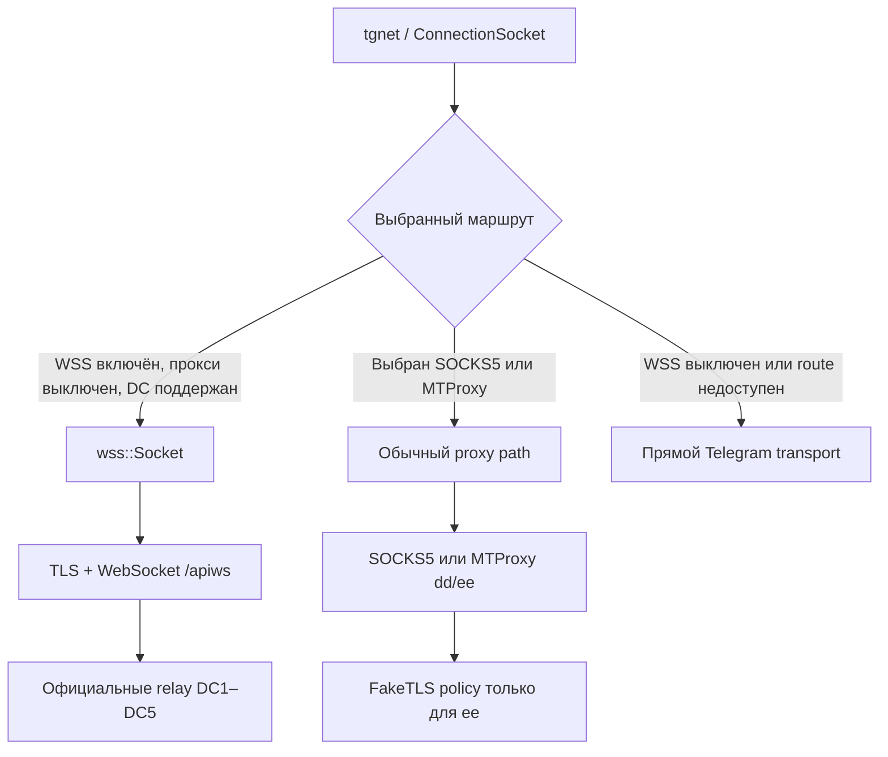

# ZaStoGram — Telegram для Android с MTProxy FakeTLS и нативным WSS


ZaStoGram — экспериментальный форк официального Telegram для Android. Он
сохраняет протокол и серверную инфраструктуру Telegram, но добавляет:

- более строгий и диагностируемый MTProxy FakeTLS для `ee`-секретов;
- управляемые JA4/TLS-профили с рабочим автопрофилем Telegram Desktop;
- отдельный нативный WSS-транспорт через официальные WebSocket-релеи Telegram;
- клиентские функции приватности, локальную историю правок и UX-настройки;
- Python-плагины, совместимые с реализованной частью API exteraGram;
- встроенные stable/dev-обновления из Forgejo Releases.

Это не новый мессенджер, не VPN и не отдельный протокол. Текущая база —
Telegram Android `12.9.2`, минимальная версия Android — 7.0 (`minSdk 24`).
Stable и dev используют разные package id, поэтому устанавливаются параллельно:
`org.zastogram.messenger` и `org.zastogram.messenger.dev` соответственно.

## Скачать

- [Последний стабильный релиз](https://git.zapret.moe/zastogram/ZaStoGram/releases/latest)
- [Все релизы и dev-сборки](https://git.zapret.moe/zastogram/ZaStoGram/releases)
- [Исходный код](https://git.zapret.moe/zastogram/ZaStoGram)

Выбирайте APK по архитектуре устройства:

| APK | Для чего |
| --- | --- |
| `arm64-v8a` | Почти все современные Android-смартфоны и планшеты |
| `armeabi-v7a` | Старые 32-битные ARM-устройства |
| `x86` | Старые 32-битные эмуляторы |

Актуальный стабильный релиз публикуется для этих трёх ABI, подписывается
релизным ключом ZaStoGram и использует канал обновлений `stable`. Сборка
`x86_64` поддерживается исходниками, но не публикуется без отдельного запроса.

Для сборки требуются Android Studio 2025.1.4, Android NDK 27.2.12479018 и Android SDK 36.

## Транспортная архитектура

Клиент не смешивает WSS, MTProxy и SOCKS5 в один комбинированный прокси.
`ConnectionSocket` выбирает один маршрут для конкретного соединения:



Главные границы конструкции:

- прямой транспорт не зависит от MTProxy lifecycle и его retry-политик;
- MTProxy policy вынесена в `TMessagesProj/jni/mtproxy/` и работает через
  фазовые состояния, evidence и один retry authority;
- WSS реализован отдельным `transport::Socket` в
  `TMessagesProj/jni/tgnet/wss/WssSocket.*` и сам владеет TCP-дескриптором,
  TLS, WebSocket upgrade и очередями кадров;
- legacy-прокси и WSS взаимоисключаемы: включение WSS выключает активный
  SOCKS5/MTProxy, а выбор обычного прокси выключает WSS;
- WSS не наслаивается поверх SOCKS5 или MTProxy.

## MTProxy FakeTLS

### Relay-контракт ClientHello

FakeTLS применяется только к MTProxy с `ee`-секретом. Перед отправкой
ClientHello проверяется по правилам reference relay:

- SNI должен байт-в-байт совпадать с доменом из `ee`-секрета;
- TLS record и handshake должны иметь согласованные длины;
- session id должен занимать 32 байта;
- первый набор шифров после relay-compatible GREASE должен быть TLS 1.3
  (`0x1301`–`0x1303`);
- размер ClientHello должен быть от канонических `517` до максимальных `4096`
  байт;
- некорректный профиль блокируется до отправки в сеть.

Lowercase, trim, punycode и вариант без SNI могут рассчитываться для
диагностики, но не подменяют wire-SNI. Relay сравнивает его с исходным доменом
из секрета.

ClientHello и последующие TLS-записи имеют собственные pending-буферы.
Неблокирующий `send()` может принять часть записи: остаток досылается на
следующем `EPOLLOUT`, а MTProto payload удаляется из очереди только после
полной отправки TLS frame.

### JA4 / TLS-профили

Автоматический профиль синхронизирован с проверенной формой Telegram Desktop:

- `Auto` отправляет рабочий Yandex-shaped профиль с намеренно сохранённой
  tdesktop-совместимой формой последнего GREASE extension;
- `Auto rotate` выбирает из проверенного пула Yandex, Firefox Android,
  Firefox и Android OkHttp и меняет профиль только после релевантного
  post-ClientHello сбоя;
- DNS-ошибки и `tcp_not_connected` не вращают JA4: ClientHello в этих фазах
  ещё не участвовал;
- Chrome Modern и Android Chrome удерживаются от отправки и переводятся на
  безопасный автопрофиль: в контрольной сети они отвечали заметно хуже рабочего
  пула;
- каждый собранный профиль повторно проходит relay-контракт перед отправкой.

Это не попытка сделать байт-в-байт копию установленного браузера. Приоритет —
сначала совместимость с MTProxy relay, затем форма JA4 и дополнительные
эксперименты.

### Управляемые слои

Настройки MTProxy находятся в обычном экране прокси и передаются Java → JNI →
native без пересборки APK:

| Настройка | Что меняет |
| --- | --- |
| `JA4 / TLS-профиль` | Выбор ClientHello-рецепта |
| `Мягкая фрагментация ClientHello` | Две неблокирующие отправки одного валидного hello |
| `Размер TLS-записей` | Размер завершённых FakeTLS ApplicationData frames |
| `Тайминги трафика` | Короткие паузы только между полностью отправленными frames |
| `Стартовая маскировка MTProxy` | Форму первых реальных MTProto ApplicationData-записей |
| `Меньше параллельных каналов` | Fanout download/upload при активном MTProxy |
| `Паттерн подключений` | Допуск и приоритет новых FakeTLS handshakes |

Размеры, тайминги и startup cover не перепаковывают MTProto в HTTP. Они меняют
только TLS-подобное обрамление уже установленного FakeTLS-соединения.

### Фазы и восстановление

MTProxy не лечит все сбои сменой JA4. Основные классы evidence разделены:

- `host_resolve_failed` — DNS и кэш endpoint;
- `tcp_not_connected` — путь до TCP и endpoint circuit breaker;
- `client_hello_sent_no_server_hello` — ClientHello/relay recipe;
- `server_hello_hmac_mismatch` — ответ пришёл, но не прошёл MTProxy HMAC;
- `post_handshake_no_appdata` — handshake завершён, data-path не начался;
- `dropped_early_after_appdata` — data-path успел заработать и быстро оборвался;
- `mtproxy_packet_sent_no_response` — отдельный lifecycle обычных `dd`/legacy
  секретов, где JA4 вообще не участвует.

Модули `MtProxyEndpointPolicy`, `MtProxyHandshakeScheduler`,
`MtProxyProbeCoordinator`, `MtProxyAdaptivePolicy`, `MtProxyRecoveryPolicy` и
`MtProxyRetryAuthority` разделяют запись фактов, выбор рецепта, координацию
проб и фактический reconnect. GUI и runtime-логи используют ту же карту фаз.

DRS пока не первым: до расширения динамических размеров записей должны быть
стабильны DNS, TCP, handshake и data-aware отправка завершённых TLS frames.
Иначе `host_resolve_failed` или `mtproxy_packet_sent_no_response` ошибочно
выглядят как проблема record sizing, хотя соответствующий слой ещё не
участвовал.

### Архитектура проверки прокси

`ProxyCheckScheduler` владеет Java-очередью проверок, native socket публикует
фазовые события, а `finishProxyCheck` завершает ровно активное поколение
проверки. Java backoff использует ту же фазовую идею ключей: network-сбои
группируются по адресу, а проверки склеиваются только по полному exact key
`host:port:username:password:secret`.

Наблюдение generic `Connected` не стирает свежую terminal phase конкретного
endpoint. Явный новый старт подключения может начать новое поколение, но не
должен стирать ещё актуальный usable success. Итог проверяется через
`Tools/analyze_mtproxy_markers.py`; verdict
`connected_without_socket_connected_marker` означает, что Java увидела
connected-state без подтверждённого native socket marker.

## Нативный Telegram WSS

WSS — настоящий TLS + WebSocket transport, а не FakeTLS и не локальный proxy
bridge. Он включается одним глобальным флажком:

**Настройки → Данные и память → Прокси → Использовать WSS транспорт**

Новая установка начинает с выключенным WSS. При миграции старый выбранный WSS
режим превращается в этот флажок, а устаревшие `host`, `port`, `path`, SOCKS и
MiniApp-поля удаляются схемой proxy config V4.

### Как строится route

- production DC1–DC5 используют `kwsN.web.telegram.org`;
- media/download/upload соединения используют соответствующий
  `kwsN-1.web.telegram.org`;
- путь WebSocket — `/apiws`, subprotocol — `binary`;
- route, DNS, TLS SNI и hostname verification используют один официальный
  hostname; ручной таблицы relay IP нет;
- WSS не наследует адрес или secret от выбранного TCP/MTProxy `dcOption`;
- obfuscated init и каждый готовый abridged MTProto packet отправляются
  отдельными binary WebSocket messages;
- test backend, неизвестные и CDN DC остаются на обычном транспорте;
- пока WSS не умеет маршрутизировать CDN DC ids, клиент не объявляет поддержку
  CDN redirects для загрузок в этом режиме.

### Что проверяет WSS socket

- TLS не ниже 1.2;
- цепочку сертификата через Android и встроенные root certificates;
- hostname через SNI и `SSL_set1_host`;
- HTTP status `101` и точный `Sec-WebSocket-Accept`;
- размеры входных/выходных буферов и WebSocket frames;
- masked client frames, binary/continuation frames и ping/pong.

В новой конструкции отсутствуют custom WSS gateway, SOCKS upstream, режим
«SOCKS внутри WSS», MiniApp bridge и локальный relay на `127.0.0.1`. Это
намеренно: WSS — простой официальный транспорт клиента, а список Telegram
proxy остаётся отдельным.

## Пользовательские функции

### ZaSto Приватность

Отдельный экран управляет клиентскими override-функциями:

- сохранять удалённые сообщения;
- сохранять view-once и самоуничтожающиеся материалы;
- хранить локальную историю редактирования сообщений;
- разрешать сохранение и пересылку защищённого контента и историй;
- разрешать скриншоты и не отправлять screenshot ping в секретном чате;
- отключать рекламные и промо-поверхности Telegram.

Это локальное поведение клиента, а не изменение серверной политики Telegram и
не полноценная система архивирования.

### Остальные изменения

- скрытие stories row и кнопки создания истории на главном экране;
- опция скрытия вкладки «Все чаты», когда создана хотя бы одна пользовательская
  папка, с переключением на первую доступную папку;
- опция «Всегда держать сеть в фоне» без вызова клиентского
  `native_pauseNetwork()`;
- online presence отправляет только выбранный аккаунт;
- кнопка прокси доступна в обычном login-flow до настройки прокси;
- контакты не вызывают автоматический prompt доступа при открытии;
- домашний DC показывается в профиле, если его можно надёжно определить;
- Android 12+ splash использует логотип ZaStoGram;
- файловые логи очищаются при старте нового процесса;
- ссылки на канал, VPN, поддержку и управляемая sponsor-строка `Zapret VPNs`.

## Плагины exteraGram

ZaStoGram запускает `.plugin`-файлы внутри приложения через CPython 3.11 и
Chaquopy. Установка:

**Настройки → Плагины → + → выбрать `.plugin` файл**

Реализованы:

- lifecycle `on_plugin_load()` / `on_plugin_unload()`;
- нативные экраны `create_settings()`;
- `client_utils`, `android_utils`, `hook_utils`, `file_utils`, `ui.alert` и
  `ui.bulletin`;
- `send_request()` и `RequestCallback`;
- `requests`, Pillow/PIL и `pyfiglet` внутри APK;
- автоматическая установка объявленных в `__requirements__` pure-Python
  зависимостей из универсальных PyPI wheel (`none-any`);
- Java hooks через Pine и Xposed-compatible API;
- post-response hook для пропуска, замены или отмены ответа.

Совместимость покрывает только реализованную поверхность exteraGram. Плагин с
другими API нужно адаптировать. Устанавливайте только доверенные плагины: они
выполняются внутри процесса Telegram и могут менять UI, сеть и данные аккаунта.

## Обновления и релизы

В APK встраиваются канал, тег Forgejo и номер сборки. Обновлятор выбирает файл по
`Build.SUPPORTED_ABIS` и не предлагает уже установленный тег.

| Канал | Package ID / имя | Forgejo Release | Логи | Назначение |
| --- | --- | --- | --- | --- |
| `stable` | `org.zastogram.messenger` / ZaStoGram | Обычный release с semver-тегом, например `1.1.1` | Выключены по умолчанию | Повседневная установка |
| `dev` | `org.zastogram.messenger.dev` / ZaStoGram Dev | Prerelease `zastogram-apk-<run>-<attempt>` | MTProxy network logs включены | Диагностика и тестирование |

Android `versionName` следует версии upstream Telegram, а версия ZaStoGram
задаётся встроенным release tag. `versionCode` включает upstream code, номер
сборки Forgejo Actions и ABI-цифру, поэтому новые сборки устанавливаются поверх
старых в правильном порядке.

Push в `master` запускает фоновую проверочную сборку трёх релизных ABI в Forgejo
Actions. Публикация stable/dev-релиза остаётся локальным процессом: он собирает
и проверяет все три APK, подписанные восстановленным production-ключом, и
загружает именно эти файлы в Forgejo Releases.

Forgejo Actions требует отдельные Telegram API credentials из repository
secrets `TELEGRAM_API_ID` и `TELEGRAM_API_HASH`. Публичная тестовая пара
Telegram запрещена релизным guard: без обоих secrets проверочная сборка
завершится ошибкой. Если собрать проект локально без своих параметров подписи,
будет использован публичный dummy key из репозитория; такой APK не заменит
сборку, подписанную production-ключом.

## Сборка из исходников

Нужны JDK 17, Android SDK 35, build-tools 35.0.0, NDK `27.2.12479018` и CMake
`3.10.2.4988404`. Для быстрого повторного native-build рекомендуется `ccache`.

```sh
git clone --recursive https://git.zapret.moe/zastogram/ZaStoGram.git
cd ZaStoGram
git submodule update --init --recursive --depth=1
```

Получите собственные `api_id` и `api_hash` в
[Telegram API development tools](https://my.telegram.org/apps) и сохраните их
вне репозитория:

```properties
# ~/.config/zastogram-signing/telegram-api.properties (права 0600)
TELEGRAM_API_ID=12345678
TELEGRAM_API_HASH=0123456789abcdef0123456789abcdef
```

Вместо файла можно передать `TELEGRAM_API_ID` и `TELEGRAM_API_HASH` через
окружение. Локальный релиз и Forgejo Actions отказываются собирать APK с
публичной тестовой парой Telegram.

Пример локальной arm64-сборки:

```sh
export ANDROID_HOME=/opt/android-sdk
export ANDROID_SDK_ROOT=/opt/android-sdk
export USE_CCACHE=1
export CCACHE_DIR="$HOME/.cache/zastogram-ccache"

./gradlew --build-cache \
  --no-configuration-cache \
  --parallel \
  -PzastoAbiFilter=arm64-v8a \
  :TMessagesProj_AppStandalone:assembleArm64Standalone
```

Gradle task-output cache уже включён для всего проекта. `ccache` повторно
использует неизменившиеся C/C++-объекты даже после потери каталога `.cxx`.
Configuration cache намеренно выключен: задачи Chaquopy 16.1 с ним пока
несовместимы. Каждая ABI собирается отдельным запуском Gradle: при совместной
конфигурации Chaquopy упаковывает runtime всех выбранных архитектур в каждый
APK. Повторные запуски используют тот же Gradle daemon, task-output cache и
`ccache`, поэтому кэш ускоряет сборку, но не попадает в готовое приложение.
`zastoAbiFilters` и одновременный запуск нескольких standalone ABI-задач
намеренно запрещены.

По умолчанию собирается stable. Для параллельно устанавливаемой dev-сборки
передайте `ZASTO_UPDATE_CHANNEL=dev`; package id, Android label и встроенный
update-channel переключатся вместе:

```sh
ZASTO_UPDATE_CHANNEL=dev ./gradlew --build-cache \
  -PzastoAbiFilter=arm64-v8a \
  :TMessagesProj_AppStandalone:assembleArm64Standalone
```

APK появится в:

```text
TMessagesProj_AppStandalone/build/outputs/apk/arm64/standalone/app.apk
```

Перед собственной публикацией настройте отдельные Telegram `api_id`/`api_hash`
и release keystore. Не публикуйте APK с чужой API-парой или публичным dummy key
как официальный релиз своего форка.

## Проверки

Основной MTProxy suite:

```sh
python3 Tools/check_mtproxy_all.py
```

Ключевые соседние guards:

```sh
python3 Tools/check_wss_transport_mode.py
python3 Tools/check_wss_official_default.py
python3 Tools/check_build_apk_workflow.py
python3 Tools/check_forgejo_update_contract.py
python3 Tools/check_plugin_client_utils_contract.py
python3 Tools/check_plugin_alert_contract.py
python3 Tools/check_plugin_python_deps.py
python3 Tools/check_runtime_resilience.py
```

Guards проверяют не только наличие строк, но и границы модулей, wire-контракты,
JNI-сигнатуры, partial writes, retry ownership, WSS TLS/WebSocket invariants и
release identity. Они не заменяют установку APK и проверку на реальной сети.

## Диагностика MTProxy

Dev APK включает подробные сетевые маркеры. На Windows/WSL лог можно собрать
готовым скриптом:

```powershell
D:\bin\platform-tools\adb.exe devices -l
```

```sh
powershell.exe -NoProfile -ExecutionPolicy Bypass \
  -File "$(wslpath -w Tools/collect_mtproxy_logs.ps1)" \
  -Adb "D:\bin\platform-tools\adb.exe" \
  -Package org.zastogram.messenger \
  -Seconds 180
```

Основные результаты:

- `mtproxy_markers.txt` — события native/Java по времени;
- `mtproxy_analysis.txt` — попытки и terminal phase;
- `mtproxy_runtime_contract.txt` — проверка handshake/data-path инвариантов;
- `mtproxy_attempts.csv` — отдельные FakeTLS-попытки;
- `mtproxy_endpoint_profile_stats.csv` — агрегат endpoint + profile;
- `mtproxy_plain_account_stats.csv` — обычные `dd`/legacy соединения;
- `mtproxy_proxy_check_stats.csv` и `mtproxy_scheduler_stats.csv` — проверки и
  control plane.

Повторная проверка сохранённой сессии:

```sh
python3 Tools/verify_mtproxy_runtime_logs.py mtproxy-logs-live/<session>
```

`mtproxy_runtime_contract.txt` подтверждает порядок live-маркеров и наличие
`transport_state=`. Сначала фиксируется `endpoint_handshake_ok`.
`endpoint_data_path_success` должен появляться только после первого `first_tls_app_recv`
для FakeTLS либо после `first_mtproxy_packet_recv` для обычного MTProxy.

Stable APK не включает принудительные сетевые логи.

## Ограничения

- FakeTLS делает старт MTProxy похожим на TLS, но не превращает MTProto в
  настоящий браузерный HTTP/2 или HTTP/1.1.
- SNI берётся из `ee`-секрета и не ротируется независимо от него.
- Record sizing, timing, fragmentation и startup cover — диагностические
  режимы, а не доказанная универсальная защита от любого DPI.
- Официальный WSS работает только для route'ов Telegram DC1–DC5. Test,
  неизвестные и CDN DC используют обычный fallback transport.
- Встроенный WSS не поддерживает custom gateway или SOCKS upstream.
- Фоновая сеть не отменяет Doze, battery saver и остановку процесса Android.
- Плагины имеют привилегии процесса приложения и требуют доверия к автору.
- Это неофициальный форк и не гарантия постоянного обхода меняющихся правил
  фильтрации.

## Основа и благодарности

- [DrKLO/Telegram](https://github.com/DrKLO/Telegram) — официальный Telegram
  Android;
- [tsrman/tg](https://github.com/tsrman/tg) — рабочая база изменений FakeTLS,
  JA4 и интервалов;
- [telemt/tdlib-obf](https://github.com/telemt/tdlib-obf) — идеи и референсы по
  профилям, DRS/IPT и диагностике.

Проект распространяется по условиям [GPL-2.0](LICENSE).
